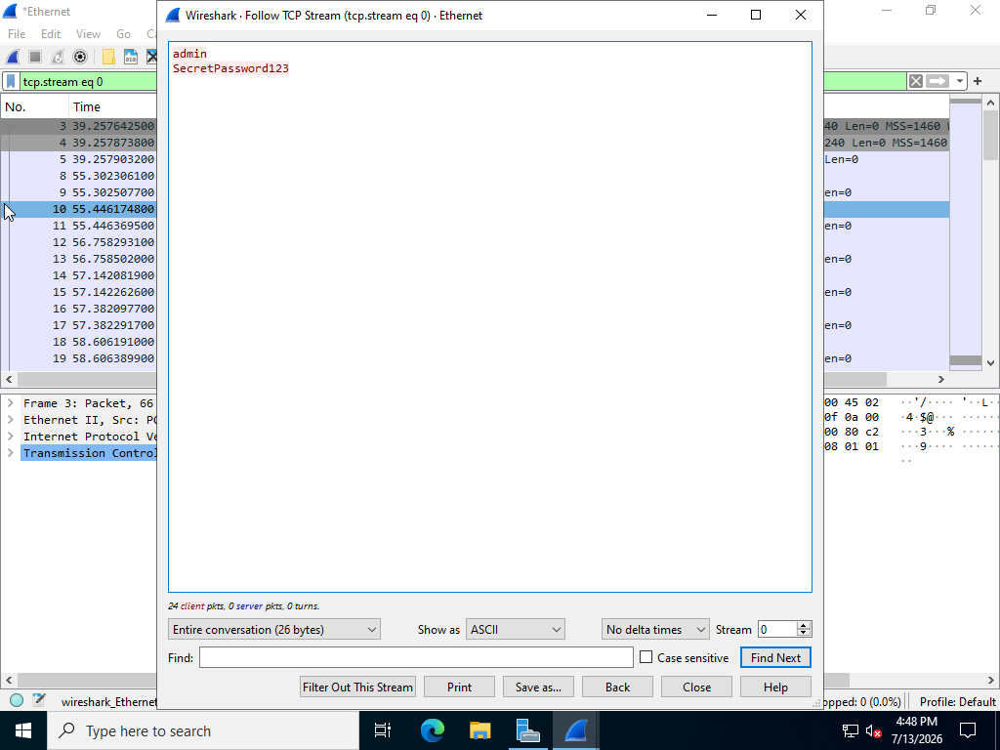
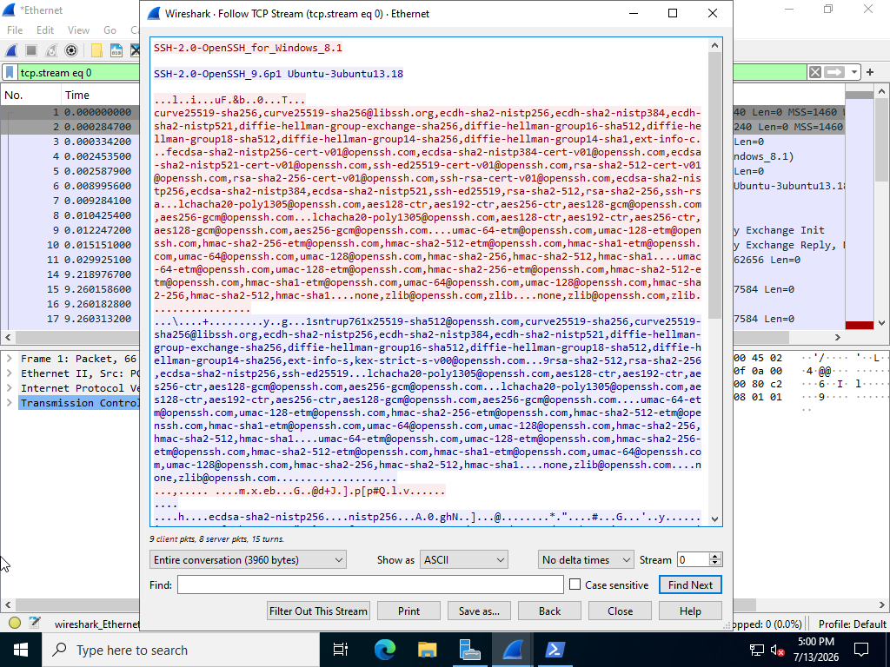

# Network Traffic Analysis: Cleartext vs. Encrypted Streams

## 1. Executive Summary
During a routine security review of my home lab network (`10.0.2.0/24`), I wanted to audit how data looks moving across the wire. This report breaks down why using legacy, unencrypted protocols is dangerous, and shows how migrating to secure protocols protects data. 

Using Wireshark, I captured credentials sent in plain cleartext over an insecure Telnet connection, and then ran the same test over a secure SSH connection to analyze how cryptography scrambles the data.

---

## 2. The Vulnerability: Unencrypted Legacy Transmission (Telnet)
First, I set up a temporary network listener on my Ubuntu Linux VM to mimic a legacy Telnet service and connected to it from my Windows Server VM. I kept Wireshark running in the background to capture the traffic.

* **What I ran:** `telnet 10.0.2.4 23`
* **Wireshark Display Filter:** `tcp.port == 23`

By isolating the conversation in Wireshark using the "Follow TCP Stream" feature, the vulnerability became instantly obvious. Because Telnet has absolutely no encryption, the login flow was completely exposed. Anyone sniffing traffic on this network could read my username and password in plain text:

> **The Risk:** If an attacker gets onto a company's internal network, they can passively sniff traffic using free tools. If administrators are still using legacy protocols like Telnet, the attacker can harvest active corporate credentials without touching a single endpoint or triggering an alert.

---

## 3. The Fix: Secure Protocol Migration (SSH)
To fix this security flaw, I disabled the unencrypted service and shifted remote management over to **Secure Shell (SSH)** on port 22, which uses transport-layer encryption.

* **What I ran:** `ssh username@10.0.2.4`
* **Wireshark Display Filter:** `tcp.port == 22`

I started a fresh packet capture and logged into the Linux machine again. This time, when I used "Follow TCP Stream" on the active network packets, the difference was night and day:

### What changed?
Instead of readable text, the entire session data was turned into completely scrambled **ciphertext**. Because SSH uses modern cryptography to build a secure tunnel, the usernames, passwords, and commands are hidden. Even if a malicious actor captures 100% of these packets, the data is useless gibberish to them without the private cryptographic keys.

---

## 4. Blue Team Takeaways & Hardening Guide

While this lab focused on Telnet, the exact same cleartext security risks apply to several other common enterprise protocols:

| Insecure Protocol | Port | Secure Alternative | How it Protects Data |
|---|---|---|---|
| **Telnet** (Remote Management) | 23 | **SSH** | Encrypts the entire terminal session |
| **HTTP** (Web Traffic) | 80 | **HTTPS** | Uses TLS to encrypt web data and credentials |
| **FTP** (File Transfers) | 21 | **SFTP** | Tunnels file transfers securely through SSH |

### Quick Defenses for a Real Network:
1. **Kill Insecure Services:** Scan network environments for active port 23, 21, or 80 listeners and shut them down.
2. **Block Ports at the Firewall:** Implement firewall rules to block lateral cleartext management traffic within internal subnets.
3. **Enforce SSH Keys:** Push SSH security further by disabling password logins entirely, where you could require cryptographic key pairs instead.
